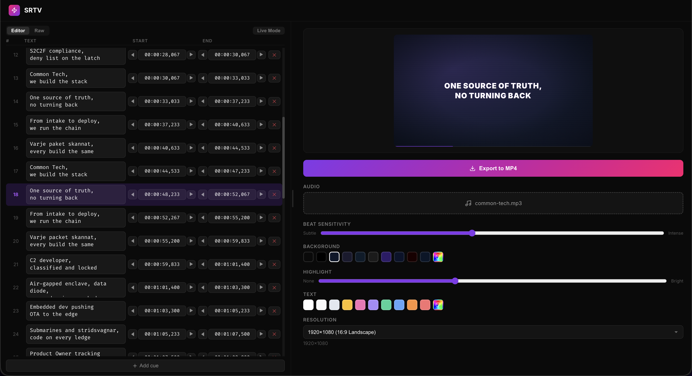

# SRTV



Turn SRT subtitles + audio into beat-synced lyric videos. Runs entirely in the browser — no server needed.

## What it does

Paste SRT, upload MP3, export MP4. The video flashes, glows, and pulses to the beat using Web Audio FFT analysis.

## Features

- SRT editor with ◀▶ timing nudge, right-click insert/delete, multi-line cues
- **Live timing mode** — press `I`/`O` to stamp cue times while audio plays
- Beat detection via FFT with adjustable sensitivity
- Configurable background/text colors, highlight intensity, resolution
- In-browser MP4 export via WebCodecs (Chrome/Edge 94+)
- Auto-saves everything to localStorage

## Run locally

```
npm install
npm run dev
```

## Deploy

```
npm run build
```

Static files in `dist/`. Works on GitHub Pages, Netlify, any static host.

## Stack

React · Remotion · @remotion/player · @remotion/web-renderer · Vite · Web Audio API
